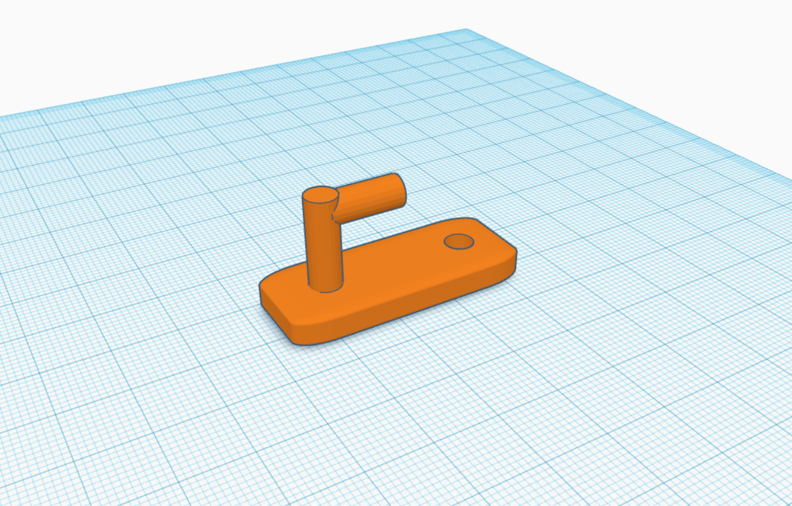

# Exercice 1

À toi de jouer ! Modélise un crochet comme ci-dessous.

## Dimensions

* 40mm de longueur.
* 16mm de largeur.
* 5mm d'épaisseur.
* Appliquer un arrondi de 3mm.
* Trou de 5mm de diamètre.
* Crochet de 5mm de diamètre et 15mm de haut.

## Solution
Essaye d'abord au maximum avant de regarder la solution !

??? tip "Afficher"

    
