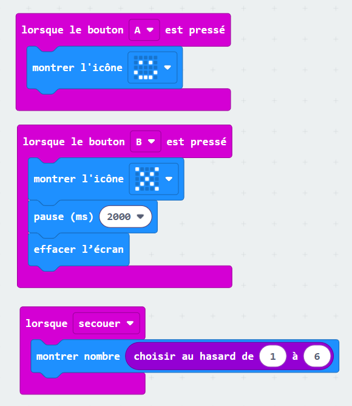

# Exercice 1

### Étape 1 
Afficher un sourire lorsque le bouton A est pressé.

### Étape 2
Lorsque le bouton B est pressé, afficher une croix pendant 2 secondes et ensuite effacer l'écran.

### Étape 3
Lorsque l'on secoue, afficher un nombre aléatoire entre 1 et 6.

## Solution
Essaye d'abord au maximum avant de regarder la solution !

??? tip "Afficher"

    
