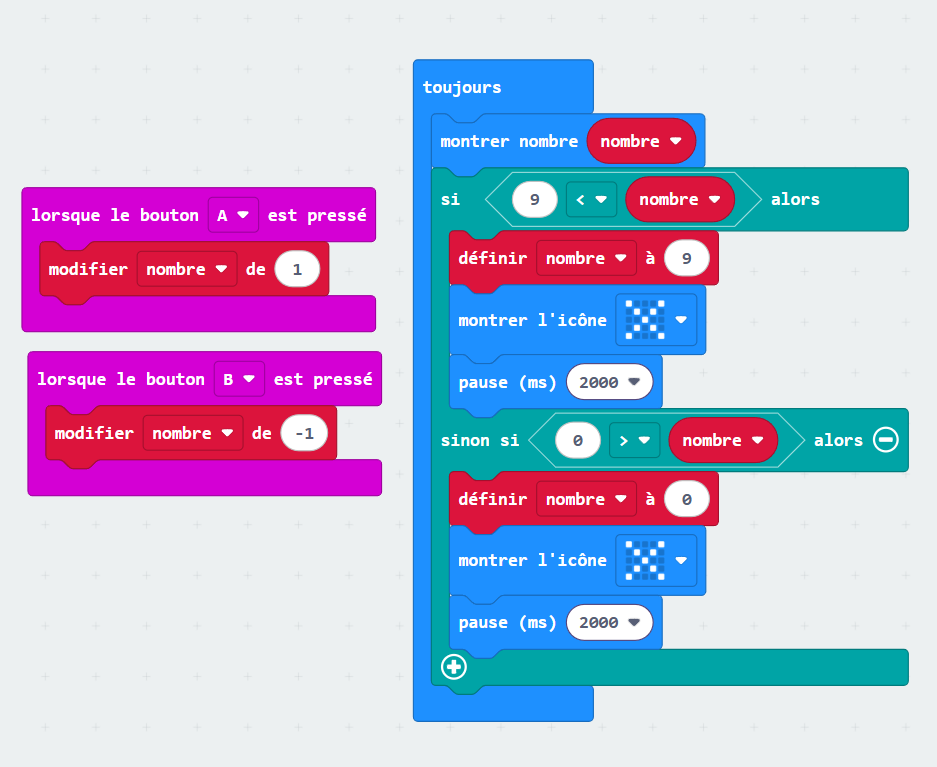

# Exercice 2

## Questions
<?quiz?>
question: Je veux afficher un texte une seule fois. Quel bloc utiliser ?
answer-correct: Au démarrage
answer: Toujours
content:
C'est juste ! Le bloc Au démarrage est exécuté une seule fois lorsque le microcontrôleur est mis sous tension.
Contrairement au bloc Toujours qui est exécuté en boucle.
<?/quiz?>

<?quiz?>
question: La mesure de lumière est comprise entre 0 et _ ?
answer: 128
answer-correct: 255
answer: 100
answer: 256
content:
Correct ! Les données d'un ordinateur sont stockées en octet (Ex: 10011100₂ = 156₁₀ et 11111111₂ = 255₁₀). 
La donnée de la lumière est d'un octet (0, 255). 
<?/quiz?>

## Exercice
* Crée une variable nommée `nombre`.
* Avec le bouton A, ajoute 1 à `nombre`.
* Avec le bouton B, soustrait 1 à `nombre`.
* N'oublie pas d'afficher `nombre`.
* Si `nombre` est plus petit que 0 ou plus grand que 9, ne modifie pas sa valeur et affiche une croix
pendant 2 secondes.

## Solution
Essaye d'abord au maximum avant de regarder la solution !

??? tip "Afficher"
    
    *(Plusieurs solutions sont possibles, en voici seulement une)*
    
