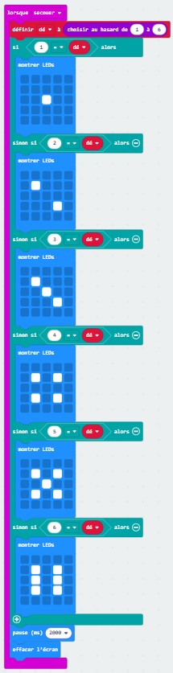
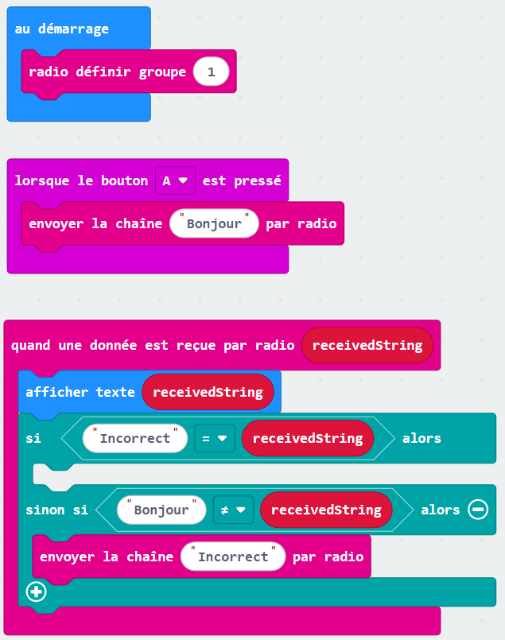

# Exercice 3

## Un dé simple
Tu te souviens comment afficher un nombre aléatoire ?

* Avec le bloc `Lorsque secouer`, affiche un chiffre aléatoire entre 1 et 6 
(regarde dans `Maths` pour les nombres aléatoires).

Maintenant, au lieu d'afficher juste un chiffre, affiche les images d'un dé 🎲.

* Crée une variable dé qui contiendra le chiffre aléatoire.
* Avec des `Si` et `Sinon`, compare la valeur pour afficher la bonne image.
* Après 2 secondes, efface l'écran.

#### Solution

??? tip "Afficher"

    

## Envoi par radio
* Dans `Radio`, défini le groupe à 1 au démarrage.
* `Lorsque le bouton A est pressé`, envoi "Bonjour" par radio.
* `Quand une donnée est reçu par radio (receivedString)`, affiche le texte reçu.

Défi : Fais en sorte que si le texte reçu n'est pas "Bonjour" de renvoyer par radio "Incorrect".

#### Solution

??? tip "Afficher"

    
