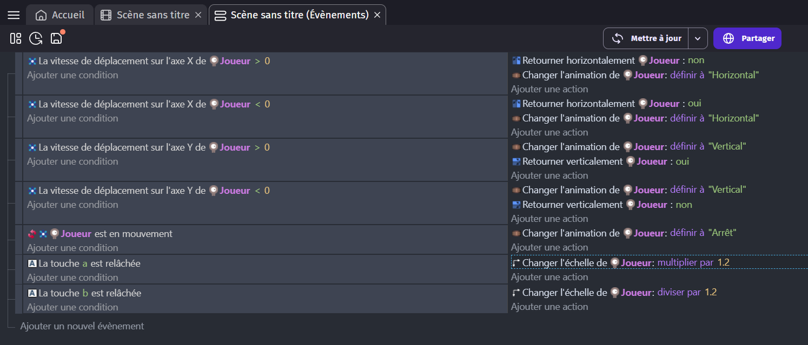

# Exercice 1

Avec les compétences apprisent lors des deux premières leçons, crée un jeu comme ci-dessous.

## Assets
[Télécharger](Assets_Ex1.zip){:download="Assets_Ex1"}

## Étapes
* Crée un projet nommé `Exercice 1` en mode portrait.
* Ajoute le joueur et crée trois animations : `Arrêt`, `Horizontal` et `Vertical`.
* Ajoute un comportement `Mouvement vu du dessus` et désactive `Tourner l'objet`.
* Compare la vitesse de déplacement sur les axes X et Y pour retourner horizontalement 
et verticalement le joueur et changer l'animation.
* Lorsque la touche A est relachée, multipler la taille (`Échelle`) du joueur par 1,2.
* Lorsque la touche B est relachée, diviser la taille (`Échelle`) du joueur par 1,2.

## Solution
Essaye d'abord au maximum avant de regarder la solution !

??? tip "Afficher"

    