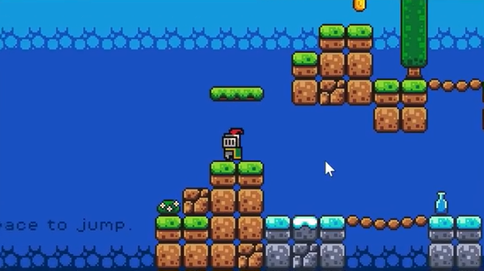
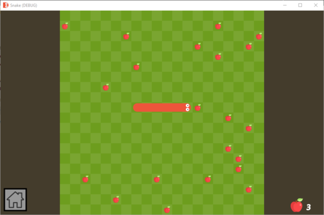

# Introduction

Apprendre la programmation en créant des jeux vidéo avec le moteur de jeu Godot 4.

## Prise en main du logiciel
Création d'un mini jeu de plateforme en 2D


## Base de la programmation GDScript 
Syntax similaire au Python
```
func _physics_process(delta):
	if not is_on_floor():
		velocity.y += gravity * delta

	if Input.is_action_just_pressed("ui_accept") and is_on_floor():
		velocity.y = JUMP_VELOCITY

	var direction = Input.get_axis("ui_left", "ui_right")
	if direction:
		velocity.x = direction * SPEED
	else:
		velocity.x = move_toward(velocity.x, 0, SPEED)

	move_and_slide()
```

## Jeu du Snake
Déveloper un mini jeu du Snake en autonomie


## Base du réseau
Jeu du Snake multijoueurs (Toute la classe dans la même partie)  
*(Adresse IP, masque sous-réseau, sockets, TCP/UDP)*

## Suite
- On continue avec le development de jeux vidéo *(jeu en 3D de type Mario Kart)*
- Ou modélisation 3D *(Apprendre à utiliser une imprimante 3D)*
- Ou programmation Python *(Notebook Jupyter, Matplotlib, Streamlit, Tk/Tcl)*
- Ou Suite Office et Latex
