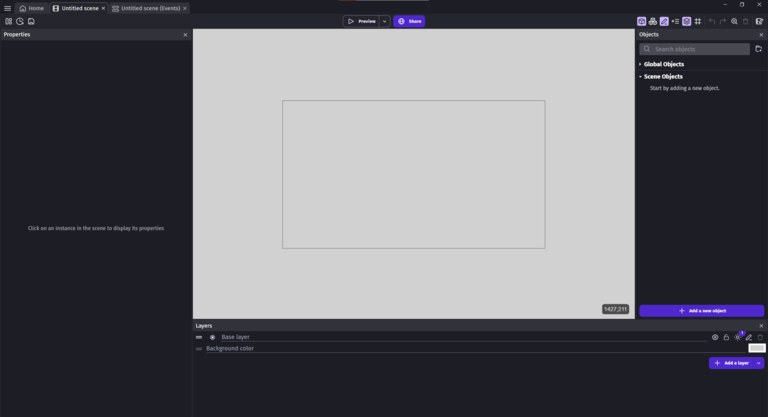
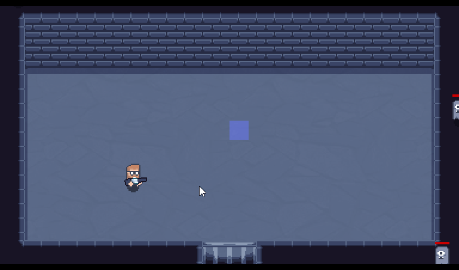

# Contenu du cours

## Développement de jeux vidéo
Apprendre les bases de la programmation graphique et le logiciel GDevelop 5  

[https://gdevelop.io/fr-fr](https://gdevelop.io/fr-fr)

### Premier projet: Mini jeu 2D de type Wave Defense
On développe ensemble pas à pas. Pour comprendre les fondamentaux de la création d'un jeu vidéo 
et la logique derrière la programmation. 

### Amélioration du premier jeu
Une fois les bases apprises, de manière autonome, effectuer quelques améliorations. Exemple:  

* Ajouter un menu.
* Comptabiliser le score.
* Ajouter de la musique.
* Créer un système de vague.
* Ajouter des contrôles pour smartphone.
* Etc...
